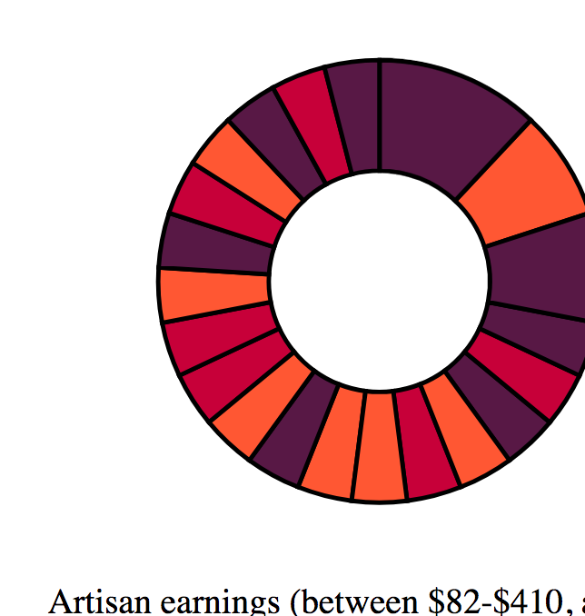
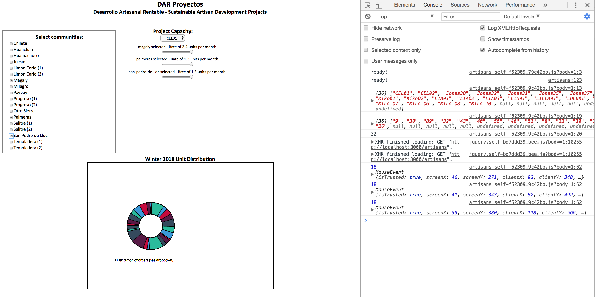

# DAR PROYECTOS application
## Desarrollo Artesanal Rentable - Sustainable Artisan Development Projects

This application runs on Rails 5.1.2, and utilizes the D3.js (version 4) library, which integrates the more recent changes to the Javascript language (ES2015/ES6).

While in development, the application can be run locally on localhost:3000/artisans.

**Aug 30/17** - csv file added to app, connected directly to AJAX call; relevant data parsed out to generate completed ring (pie) chart, bar chart in progress.

**Sept 22/17** - replaced csv file with current order data, commented out d3 charts for the time being; setting up index page to take production capacity inputs.

**Sept 23/17** - Set up working UI, configured scripts to run test message in browser when checkbox is selected. D3 chart temporarily taken down to focus on setting up layout in artisans.js.

**Sept 30/17** - Added dropdown populated by order data, checkboxes and range sliders successfully add and delete; D3 chart added back in, refocused to show number of unit in each order (labels/legend pending)

