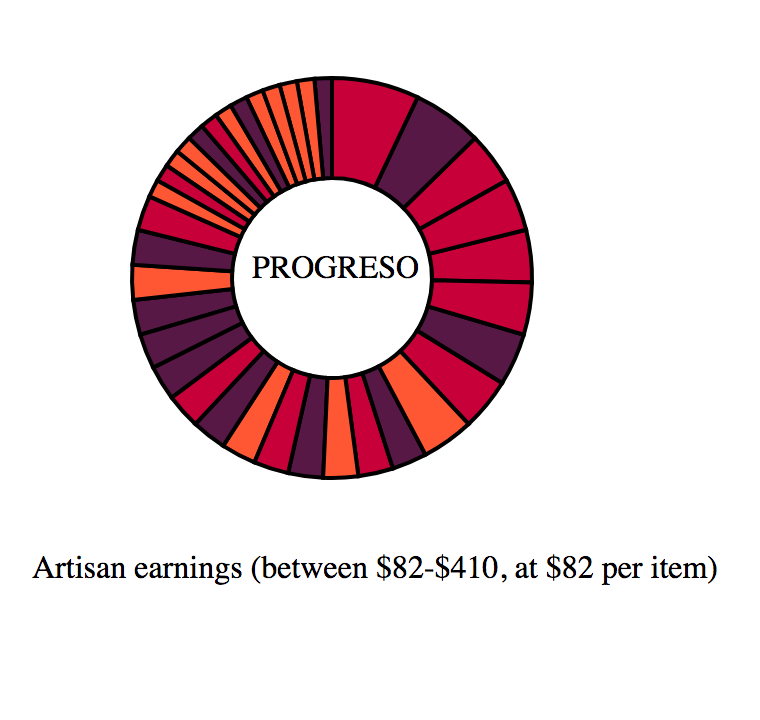

# DAR PROYECTOS application
##Desarrollo Artesanal Rentable - Sustainable Artisan Development Projects

This application runs on Rails 5.1.2, and utilizes the D3.js (version 4) library, which integrates the more recent changes the the Javascript language (ES2015/ES6).

While in development, the application can be run locally on localhost:3000/artisans.

